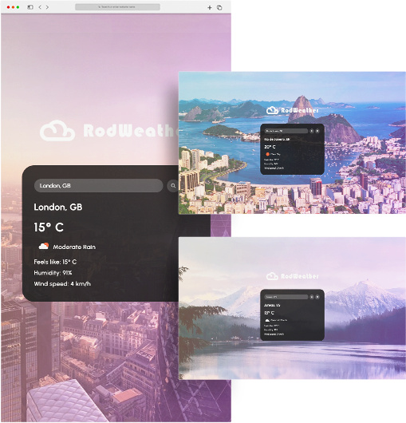

## Table of contents

- [Overview](#overview)
  - [The purpose](#the-challenge)
  - [Screenshot](#screenshot)
  - [Link](#links)
- [My process](#my-process)
  - [Built with](#built-with)
- [Author](#author)

## Overview

Access current weather data for any location on Earth with images from chosen city displayed in the background.

### The purpose

Users should be able to:

- View the optimal layout for the site depending on their device's screen size
- See the weather information for any desired location
- An image related to the location should be displayed in the background
- The autocomplete function should help users find specific locations
- The geo location button should display weather information for the user's current location

### Screenshot

### Link

- Live Site URL: [Follow this link](https://rodrigodelascio.github.io/RodWeather/)

### Built with

- HTML
- CSS
- JavaScript
- OpenWeather API
- Geo DB Cities API
- Unsplash API

## Author

- Website - [Rodrigo de Lascio](https://rodrigodelascio.co.uk/)
- GitHub - [@rodrigodelascio](https://github.com/rodrigodelascio)
- LinkedIn - [@rodrigodelascio](https://www.linkedin.com/in/rodrigo-de-lascio/)
